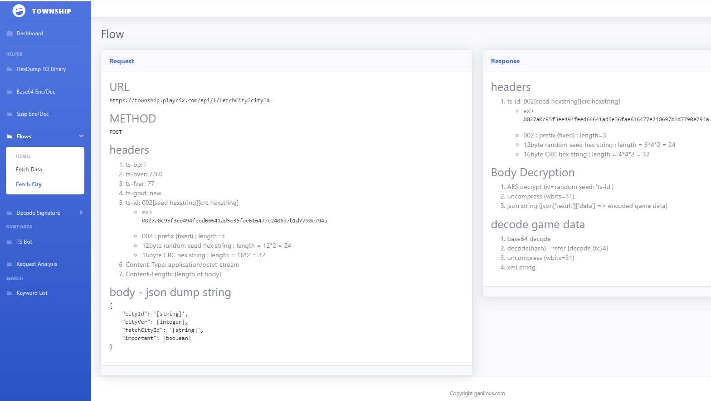
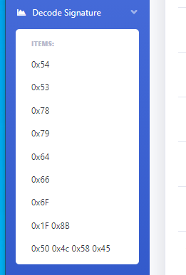
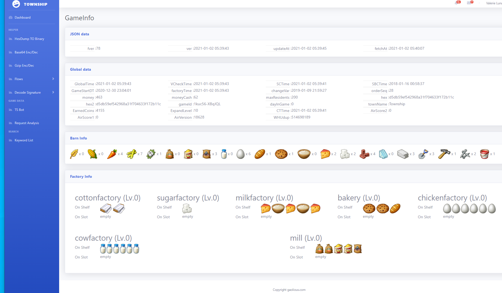

# township - python

 - township - cpp 로 테스트가 완료된 코드들을 web에서 보기 위해 django로 convert 함.
 - cpp의 struct, union 및 type cast를 이용(offset)하기 위해 bytearray의 wrapper class 생성
 - pytest로 체크. 

## Environment

### django
```
Python : 3.9
Django : 3.1.4
Web Template : SB-Admin2
```
### pytest
- pytest.mark.parameterize 의 데이터는 환경변수로 전달되므로, 
- network으로 전달되는 data가 상당히 크기 때문에 별도의 py파일로 생성하여 테스트.
  (OS의 환경변수 최대 길이에 의존)

```
pytest==6.1.2
pytest-cov==2.10.1
pytest-django==4.1.0
```

## 진행상황

- (complete) Fetch City : retreive city info
- (complete) save City : save city info
- (complete) Encode/Decode asset XML files
- (complete) Encode/Decode/Parse GlobalInfo.xml, LocalInfo.xml, mGameInfo.xml

- (Banned ;;) 아이템 수량 수정후 저장을 하니 바로 BAN. .. ;; 
- 서버에서 Item/Resource 수량 체크를 하고 있으니 Bot 만드는 것을 중단.

## Capture Images


